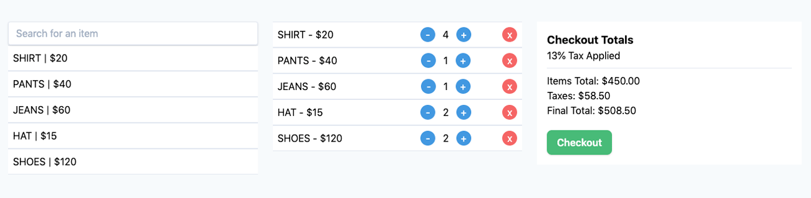

This project is my simple React Point of Sale frontend I built to test different approaches with. I have since gone on to build a working version of this with Laravel Livewire, however I will be incorporating AlpineJS or Vue in the next versions to limits calls to the backend.

This project was bootstrapped with [Create React App](https://github.com/facebook/create-react-app).

In the project directory, you can run:

### `npm start`

Runs the app in the development mode. 
Open [http://localhost:3000](http://localhost:3000) to view it in the browser.